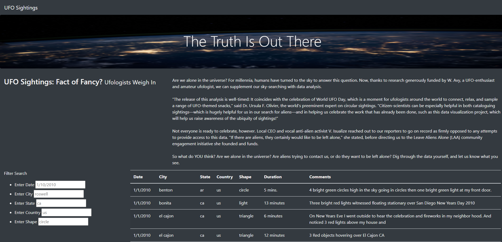
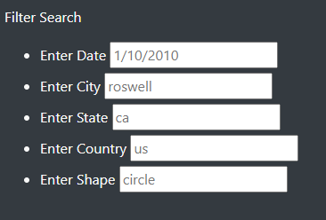
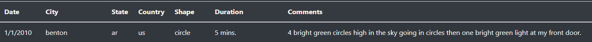
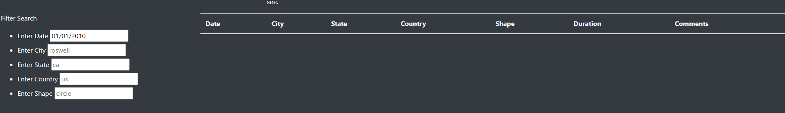
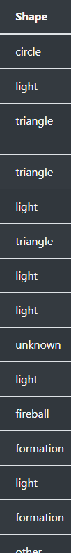

# UFOs
## Overview of Project
Create a dynamic table on an existing site that can be filtered to update the table without loading a new page.

## Results
 

*This is the default view of the website created for UFO sightings*

 

*This is filter set up for the information available*

 

*The filters set up to filter data are date, city, state, country, and shape*

Using an existing dataset from data.js that was inputted by javascript in the app.js, I created a table that could update based on the filters seen above.
In order to filter, the data must be inpurted the same way that is is in the table.

To illustrate the formatting needed to properly filter, I will use the first entry as an example.
 

For example, the date must be M/D/YYYY and not MM/DD/YYYY. If I were to input 01/01/2010 nothing would show even though data exists for 1/1/2010 because it is directly looking at table and the table has it as M/D/YYYY.
 

Similarly, the city, must be typed in all lowercase to match. For the first entry, if one types "Benton" instead of "benton" no data will show on the table.
For the state, it must be lower case, and the abbreviation. If one types "AR" instead of "ar" the first entry will not show
For the country, is must also be the two letter abbreviation and lowercase. If one types "united states" the first entry will not show.
For the shape, it was has to match the exact format and spelling of the existing shapes. For example, to get the first entry, one would have to use "circle". To get any entry on "triangle", "light", "fireball", "Unknown", "formation", "other" and many more filters can be used but it has to match the formating from our file in data.js.

 

*Some of the many "shape" filters*

It will not show any data if it does not match exactly what is in data.js file.

One can just search using one of the filters to use as many filters as they want so long as the data exists.

## Summary
Drawback
- As I alluded to above, a drawback is that the formatting has to match exactly. If the item has any uppercase letters, excess letters, excess numbers, it wi,ll not match.

Ways to make the information more easily searchable
- On the site, a list of shapes could be provided as one might not know all of the potential shapes entered from data.js.
- The best option would be to create a dropdown from the existing data so that the end user does not have to type for the city, state, country, and shape. 
    - For the date, it would be helpful to have a pop-up calendar with a selectable date or range to narrow down information.

- It would also be useful to have a download button so one can easily export the filtered information.

